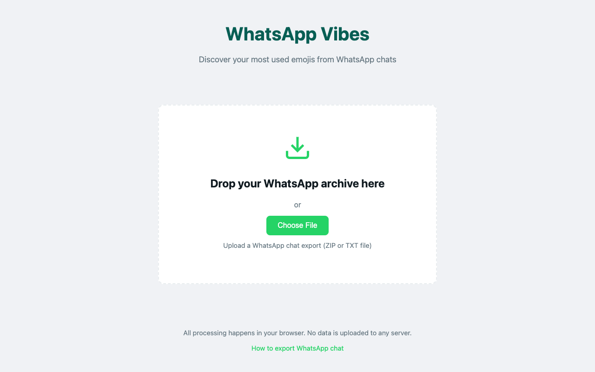
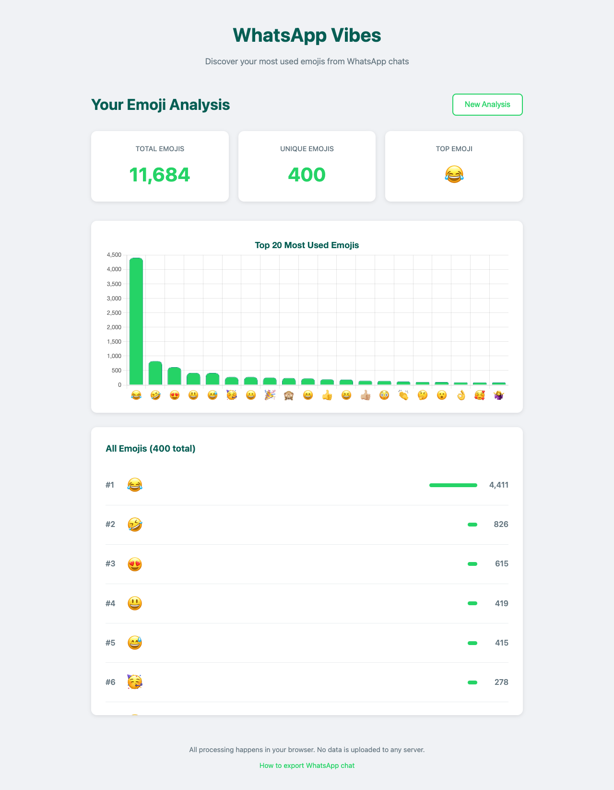

# WhatsApp Vibes 📊🎭

A privacy-focused web application that analyzes your WhatsApp chat exports to reveal emoji usage patterns and insights. All processing happens locally in your browser - your data never leaves your device.

## Analysis Results Example

## Features

- 📱 **Privacy First**: All analysis happens client-side - no data is uploaded to any server
- 📊 **Comprehensive Analysis**: Get detailed statistics about your emoji usage
- 📈 **Beautiful Visualizations**: Interactive bar charts showing your top 20 most used emojis
- 🎯 **Accurate Detection**: Uses modern Unicode segmentation for proper emoji detection
- 📥 **Easy Import**: Supports both ZIP and TXT WhatsApp chat exports
- 🎨 **WhatsApp-Themed UI**: Familiar green interface that feels like home

## Quick Start

Visit the [live demo](https://pb.nxh.ch/f/VnRCYZrHrUp9) or open `index.html` directly in your browser.

## How to Use

1. **Export your WhatsApp chat**:
   - **Android**: Open chat → Menu (⋮) → More → Export chat → Without media
   - **iPhone**: Open chat → Contact name → Export Chat → Without Media

2. **Upload to WhatsApp Vibes**:
   - Drag and drop your exported file (ZIP or TXT) onto the upload area
   - Or click to browse and select your file

3. **View your results**:
   - See total emojis used, unique emojis, and your top emoji
   - Explore the interactive bar chart of your top 20 emojis
   - Browse the complete ranked list of all emojis you've used

### Building Minified Version
The `whatsapp_vibes.html` file contains a minified version with all CSS and JavaScript inlined for easy distribution.

## Privacy & Security
- ✅ **No server uploads**: All processing happens in your browser
- ✅ **No data storage**: Files are processed in memory and discarded
- ✅ **No tracking**: No analytics or user tracking
- ✅ **Open source**: Inspect the code to verify our claims

## License

This project is licensed under the MIT License - see the [LICENSE](LICENSE) file for details.

---

Made with ❤️ and lots of 😂 emojis
